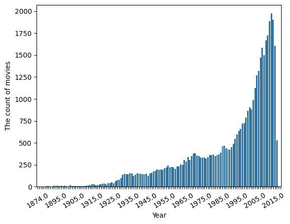

# adastra
Adastra Tech Task for DS position.

Main file is `setup.py`

You can see result running in `task.ipynb`

Answers the questions for the task:
1. *Load the dataset from a CSV file.*  
I loaded files with data from [here](https://www.kaggle.com/rounakbanik/the-movies-dataset). Later I prepared it (for example, deleted rows with `imdbId` is `nan` and duplicates) and created common dataset. 
2. *Print the number of the unique movies in the dataset.*  
Final dataset has 45416 unique movies.
3. *Print the average rating of all the movies.*  
The average rating of all the movies 3.06.
4. *Print the top 5 highest rated movies.*  
Max rating is 5. I printed random 5 movies with highest rating. For example:  

| Title | Year | Gerne | Director |
| ----- | ---- | ----- | -------- |
| Dazed and Confused | 1993 | comedy, drama | Richard Linklater |
| PTU   | 2003 | action, crime, drama | Johnnie To |
| OC87: The Obsessive Compulsive, Major Depression, Bipolar, Asperger's Movie | 2012 | documentary | Bud Clayman, Glenn Holsten, Scott Johnston |
| Black Peter | 1964 | comedy, drama | Miloš Forman |
| Tom Sawyer  | 2011 | adventure | Hermine Huntgeburth |

5. *Print the number of movies released each year.*  
This list is big. You can see it in console. Here I attached plot:

6. *Print the number of movies in each genre.*  

| Gerne   | Amount |
| ------- | ------ |
|drama    | 20240 |  
|comedy   | 13173 |
|thriller | 7617  |
|romance  | 6728  |
|action   | 6589  |
|horror   | 4671  |
|crime    | 4303  |
|documentary | 3929|  
|adventure   | 3487| 
|science fiction | 3043|  
|family    | 2767 |
|mystery   | 2463 | 
|fantasy   | 2307 |
|animation | 1928 |
|foreign   | 1617 |
|music     | 1597 |
|history   | 1397 |
|war       | 1322 |
|western   | 1041 |
|tv movie  | 766  |

7. *Save the dataset to a JSON file.*  
`setup.py` allows to save final dataset to json.
